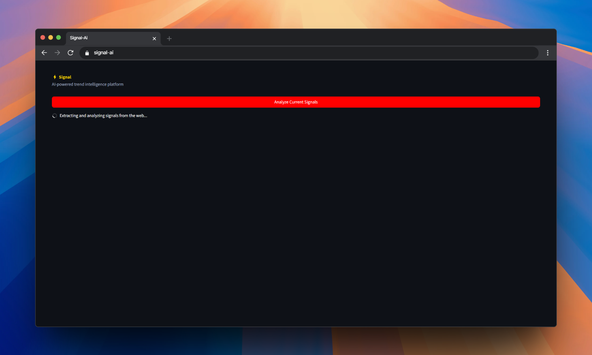
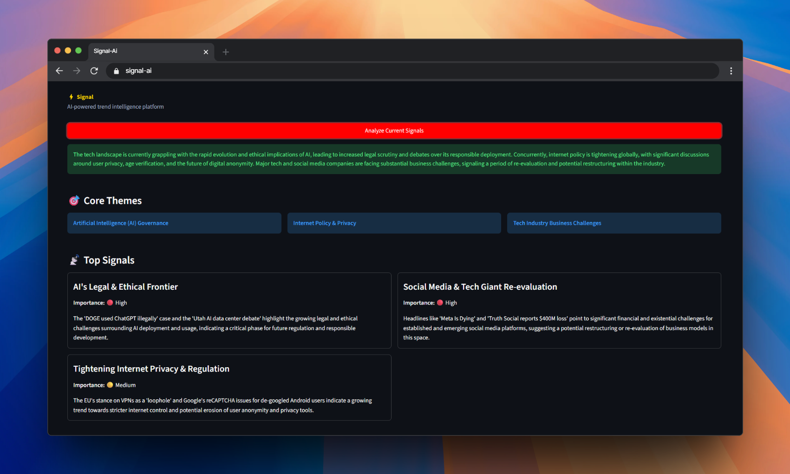

# ⚡ Signal

**AI-powered trend intelligence platform for detecting emerging signals across the internet.**


---

## 📖 Overview

Signal is an intelligent platform that continuously extracts raw data from technology hubs like **Reddit** and **Hacker News**, processes it using Google's **Gemini 2.5 Flash** AI model, and displays actionable insights through a modern, interactive dashboard.

## ✨ Features

- **Real-time trend analysis**: Fetch the latest hot topics directly from the web.
- **AI-generated structured summaries**: Get executive overviews of what is happening right now.
- **Signal scoring system**: Automatically categorizes trends by importance (**High** / **Medium** / **Low**).
- **Topic clustering**: Groups signals into core architectural themes.
- **Interactive dark-mode dashboard**: A sleek and minimalist UI built for productivity.

## 🛠️ Stack

- **Python**
- **FastAPI**
- **Streamlit**
- **Gemini API**
- **Requests**

## 🏗️ Architecture

```text
Sources (Reddit/HN) ➔ FastAPI (Data Ingestion) ➔ Gemini AI (Inference & Scoring) ➔ Streamlit (UI)
```

## 📸 Screenshots




## 🚀 Setup & Installation

Follow these instructions to get the platform running locally:

**1. Clone the repository**
```bash
git clone https://github.com/your-username/signal-ai.git
cd signal-ai
```

**2. Create a virtual environment**
```bash
python -m venv venv
```

**3. Activate the environment and install dependencies**
```bash
# Windows
venv\Scripts\activate
# macOS/Linux
source venv/bin/activate

pip install -r requirements.txt
```

**4. Environment Variables**
Create a `.env` file in the root directory (you can copy `.env.example`) and add your Gemini API Key:
```env
GEMINI_API_KEY=your_gemini_api_key_here
```

**5. Run the Backend API**
Open a terminal and start the FastAPI server:
```bash
uvicorn backend.main:app --reload
```

**6. Run the Frontend Dashboard**
Open a second terminal and start the Streamlit UI:
```bash
streamlit run frontend/dashboard.py